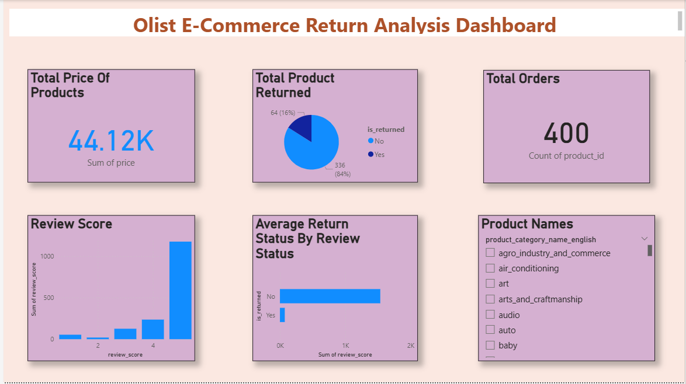

# Olist E-Commerce Return Analysis

  

Identifying why customers return orders on Brazil's largest e-commerce platform — and what the business can do about it.

---

## The problem

Returns are expensive: they cost money in logistics, hurt seller ratings, and signal a mismatch between customer expectations and product reality. This project analyzes 400 orders from the Olist marketplace to identify which products are returned most, what drives returns, and what actions could reduce them.

---

## What makes this project different

The original dataset had no return flag. I engineered the `is_returned` column using the logic: if `review_score < 3` → returned = 1, else → 0. This reflects how real analysts work — deriving business signals from available data when direct labels don't exist.

---

## Key findings

- 64 out of 400 orders (16%) were classified as returned based on review score analysis
- Returned orders showed a strongly skewed review distribution — concentrated at scores 1 and 2
- Non-returned orders averaged significantly higher review scores, validating the engineered feature
- Certain product categories showed repeat return behavior, suggesting listing or quality issues
- Total inventory value across analyzed orders: R$44,120

---

## Dashboard

---

## My approach

| Step | What I did |
|------|-----------|
| Data sourcing | Downloaded multi-file Olist dataset from Kaggle, identified and merged relevant CSVs |
| Excel cleaning | Removed duplicates, handled nulls, standardized date formats, dropped irrelevant columns |
| Python cleaning | Addressed data type issues, filtered outliers, validated entries using Pandas |
| Feature engineering | Created `is_returned` binary column using review score threshold logic |
| KPI computation | Return rate = (returned orders / total orders) × 100 |
| Visualization | Built interactive Power BI dashboard with KPIs, return-by-category charts, review score distribution |
| Insights | Generated business recommendations for sellers to reduce return rates |

---

## Tech stack

`Python` `Pandas` `Matplotlib` `Microsoft Excel` `Power BI` `IBM Watson Studio` `Kaggle`

---

## Files in this repo

| File | Description |
|------|-------------|
| `olist_cleaned_data.xlsx` | Cleaned and merged dataset (400 rows) |
| `dashboard.png` | Power BI dashboard screenshot |

---

## About this project

Built during my IBM × CSR Box virtual internship on data analytics (Arya College of Engineering, 2025). I independently handled every phase — from merging raw CSV files to designing the final dashboard. The most interesting challenge was that the dataset contained no direct return label, which forced me to derive the signal from customer review behavior. That decision became the backbone of the entire analysis.

---

*Dataset source: [Olist E-Commerce Dataset — Kaggle](https://www.kaggle.com/datasets/olistbr/brazilian-ecommerce)*
